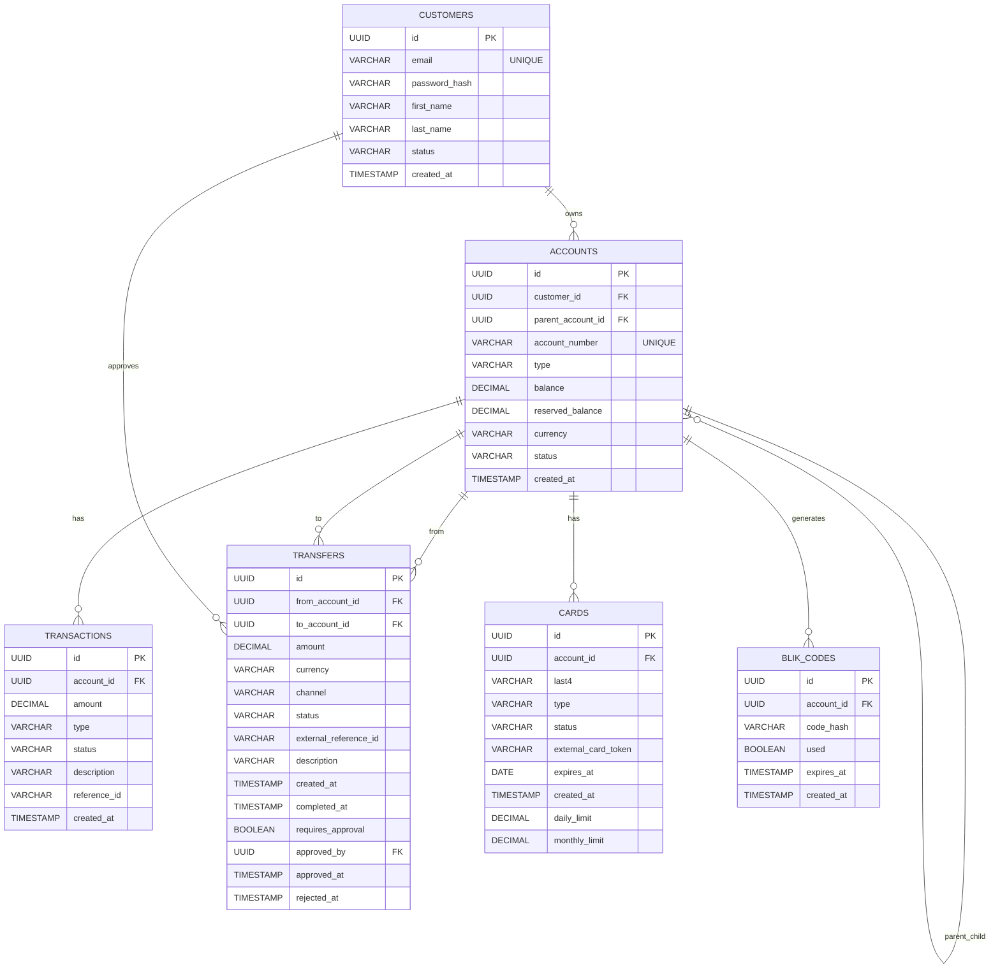

# EU Bank System

Celem projektu jest implementacja procesu biznesowego: systemu rozliczania przelewów i płatności pomiędzy bankami.

## Stack

| Warstwa         | Technologia                                                       |
|-----------------|-------------------------------------------------------------------|
| Backend         | Java 17 + Spring Boot + Spring Data JPA + Spring Security + Maven |
| Frontend        | React 19 + Vite + Tailwind                                        |
| Baza danych     | PostgreSQL 16 + system migracji: Flyway                           |
| Infrastruktura  | Docker + Docker Compose                                           |

## Zakres Funkcjonalności

### Integracja z modułem kart płatniczych

Backend banku integruje się z zewnętrznym modułem `FilipSl3/Karty-Platnicze-Aplikacje-Biznesowe` jako bank-wydawca kart. Moduł kart powinien działać z gatewayem REST pod adresem `http://localhost:8072`.

Konfiguracja po stronie banku:

```env
CARD_NETWORK_BASE_URL=http://host.docker.internal:8072
CARD_NETWORK_API_KEY=bank-key-eu-a
CARD_NETWORK_HMAC_SECRET=secret-eu-a-hmac
```

Endpointy banku:

| Metoda | Endpoint | Opis |
|---|---|---|
| `POST` | `/api/cards` | Zamawia kartę w zewnętrznej sieci kartowej i zapisuje token lokalnie |
| `GET` | `/api/cards` | Lista kart zalogowanego klienta |
| `GET` | `/api/cards/{cardId}` | Szczegóły karty |
| `POST` | `/api/cards/{cardId}/activate` | Aktywacja karty fizycznej/prepaid |
| `POST` | `/api/cards/{cardId}/block` | Blokada karty |
| `POST` | `/api/cards/{cardId}/unblock` | Odblokowanie karty |
| `PATCH` | `/api/cards/{cardId}/limits` | Lokalna aktualizacja limitów |

Przykład wydania karty:

```json
{
  "accountId": "uuid-rachunku",
  "cardType": "VIRTUAL",
  "initialBalance": 0,
  "dailyLimit": 1000,
  "monthlyLimit": 5000
}
```

Pełny PAN i CVV są zwracane przez endpoint wydania karty tylko raz. Bank zapisuje lokalnie wyłącznie token, zamaskowany PAN, ostatnie 4 cyfry i status.


## Struktura Bazy Danych 



## Uruchomienie aplikacji

Aby uruchomić aplikację w środowisku developerskim, upewnij się, że posiadasz zainstalowane narzędzia Docker oraz Docker Compose.

1. Sklonuj repozytorium:
   ```bash
    git clone https://github.com/SooNlK/eu-bank-system.git
    cd eu-bank-system
   ```

2. Skonfiguruj zmienne środowiskowe:
    ```bash
    cp .env.example .env
    ```
    *Ewentualnie dostosuj wartości takie jak hasła czy loginy w pliku `.env`.*

4. Uruchom kontenery przy użyciu dokera:
    ```bash
    docker-compose up --build
    ```
4. Aplikacja powinna być dostępna:
    - Frontend pod adresem: `http://localhost:<PORT_Z_ENV>` (domyślnie: np. 80 / 3000 w zależności od vity/nginx)
    - Backend pod adresem: `http://localhost:<PORT_Z_ENV>` (domyślnie: 8080)
    - Baza Danych (Port mapowany: `5432`)
