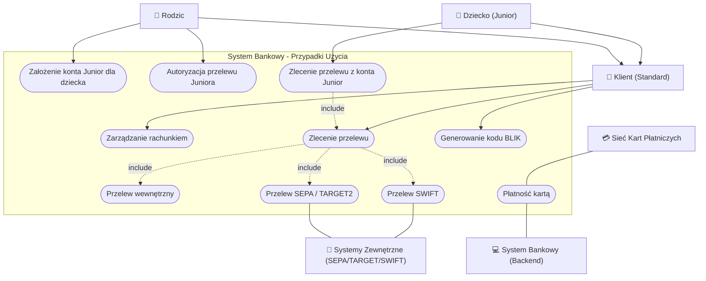
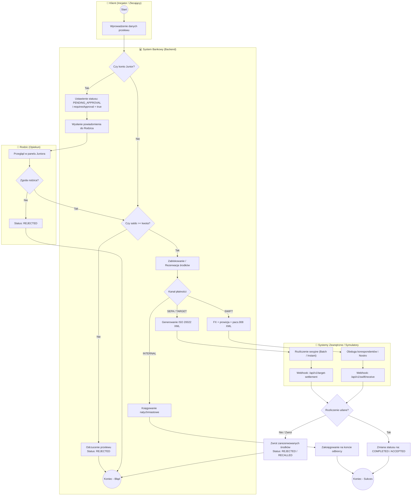
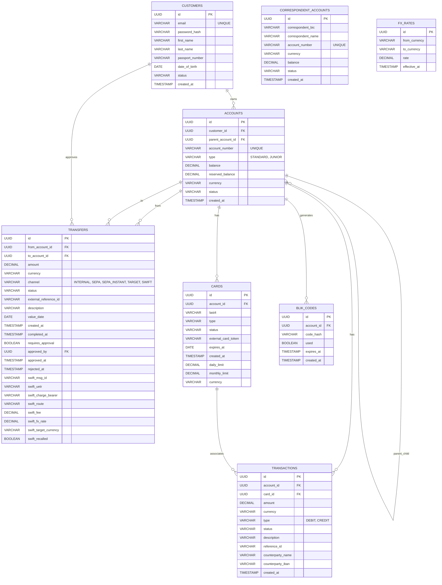

# EU Bank System

Projekt systemu bankowego w strefie euro obsługującego konta osobiste, konta dla dzieci (Junior) z mechanizmem zatwierdzania przelewów, transakcje kartowe, a także rozliczenia przelewów krajowych i międzynarodowych w formatach ISO 20022 / SWIFT.

## Stack Technologiczny

| Warstwa | Technologia                                                         |
| :--- |:--------------------------------------------------------------------|
| **Backend** | Java 17 + Spring Boot 3 + Spring Data JPA + Spring Security + Maven |
| **Frontend** | React 19 + Vite                                                     |
| **Baza danych** | PostgreSQL 16 + Flyway (migracje schematów od V1 do V19)            |
| **Infrastruktura** | Docker + Docker Compose                                             |

## Zakres Funkcjonalności

System bankowy realizuje szereg kluczowych procesów biznesowych związanych z obsługą klientów detalicznych, operacjami na rachunkach oraz integracją z zewnętrznymi systemami płatności i sieciami kartowymi.

### Diagram Przypadków Użycia (Use Case Diagram)

Poniższy diagram przedstawia główne przypadki użycia systemu w podziale na role (Rodzic, Dziecko, Klient Standardowy) oraz interakcje z systemami zewnętrznymi:



---

### 1. Zarządzanie Kontami: STANDARD oraz JUNIOR (Rodzic-Dziecko)

System obsługuje dwa typy rachunków zdefiniowane w klasie [AccountType](file:///Users/krzysztof/Desktop/eu-bank-system/backend/src/main/java/com/bank/domain/account/AccountType.java):
*   **STANDARD**: Domyślne konto oszczędnościowo-rozliczeniowe dla dorosłego klienta.
*   **JUNIOR**: Konto przeznaczone dla dzieci w wieku 7-13 lat. Zakładane i zarządzane jest wyłącznie przez zalogowanego Rodzica (opiekuna) za pośrednictwem endpointów w [AccountController.java](file:///Users/krzysztof/Desktop/eu-bank-system/backend/src/main/java/com/bank/api/AccountController.java).

> [!IMPORTANT]
> **Mechanizm zatwierdzania przelewów (Parent Approval Flow):**
> Wszystkie przelewy zlecane z konta typu **JUNIOR** (zarówno wewnętrzne, jak i zewnętrzne) wymagają zgody rodzica:
> 1. Inicjowany przelew otrzymuje status `PENDING_APPROVAL` oraz flagę `requiresApproval = true`.
> 2. Rodzic ma wgląd w oczekujące przelewy na dedykowanym panelu zarządzania kontem Juniora (`GET /api/transfers/pending-approval`).
> 3. Rodzic podejmuje decyzję o zatwierdzeniu (`POST /api/transfers/{id}/approve`) lub odrzuceniu (`POST /api/transfers/{id}/reject`) przelewu w [TransferService.java](file:///Users/krzysztof/Desktop/eu-bank-system/backend/src/main/java/com/bank/service/TransferService.java).
> 4. Zatwierdzenie powoduje natychmiastowe zablokowanie i zaksięgowanie/wysłanie środków. Odrzucenie anuluje transakcję.

---

### 2. Przelewy Krajowe i Europejskie (INTERNAL, SEPA & TARGET2)

Obsługiwane są kanały płatności zdefiniowane w [TransferChannel](file:///Users/krzysztof/Desktop/eu-bank-system/backend/src/main/java/com/bank/domain/transfer/TransferChannel.java):
*   `INTERNAL`: Bezpłatne i natychmiastowe rozliczenia wewnątrzbankowe pomiędzy rachunkami prowadzonymi w tym samym systemie.
*   `SEPA` (SEPA Credit Transfer): Przelewy zewnętrzne rozliczane w trybie sesyjnym (Batch). Paczki przelewów są generowane w formacie ISO 20022 XML i przesyłane do zewnętrznego symulatora rozliczeniowego.
*   `SEPA_INSTANT`: Przelewy natychmiastowe strefy euro realizowane w czasie rzeczywistym (do limitu 100 000 EUR na transakcję).
*   `TARGET` (TARGET2): Rozliczenia brutto w czasie rzeczywistym (RTGS) dla dużych kwot w strefie euro, wymagające podania kodu BIC banku odbiorcy.

#### Asynchroniczne Rozliczanie i Webhooki:
Backend udostępnia endpoint webhooka w [TargetWebhookController.java](file:///Users/krzysztof/Desktop/eu-bank-system/backend/src/main/java/com/bank/api/TargetWebhookController.java) (`POST /api/v1/target-settlement`). Służy on do przyjmowania asynchronicznych powiadomień z symulatora płatniczego o statusie realizacji przelewów wychodzących oraz do procesowania przelewów przychodzących z innych banków.

#### Diagram BPMN dla Procesu Przelewu

Poniższy diagram przedstawia pełny przepływ transakcji przelewu od momentu zlecenia przez klienta, przez weryfikację konta Junior i autoryzację rodzica, aż po rozliczenie zewnętrzne z użyciem webhooków:



---

### 3. Integracja z Siecią SWIFT (Przelew Międzynarodowy)

System obsługuje wielowalutowe przelewy międzynarodowe i transgraniczne w kanale `SWIFT` poprzez integrację z symulatorem sieci SWIFT (`Jkwasnyy/SWIFT-Aplikacje-Biznesowe`).

#### Architektura i Przepływ Logiczny SWIFT:
1.  **Format wiadomości (ISO 20022 pacs.008)**:
    Transakcje SWIFT są przesyłane w standardzie komunikatów XML **pacs.008** (Customer Credit Transfer). Za budowanie paczek XML odpowiada [Pacs008Builder.java](file:///Users/krzysztof/Desktop/eu-bank-system/backend/src/main/java/com/bank/client/swift/Pacs008Builder.java), a za ich przetwarzanie [Pacs008Parser.java](file:///Users/krzysztof/Desktop/eu-bank-system/backend/src/main/java/com/bank/client/swift/Pacs008Parser.java).
2.  **Obsługa Walut i Tabele FX**:
    Wspierane są waluty: `EUR`, `USD`, `GBP`, `PLN`, `CHF`. Konwersje walutowe i wyliczanie kwot transakcji odbywają się na podstawie aktualnych kursów w tabeli `FX_RATES` przez [FxService.java](file:///Users/krzysztof/Desktop/eu-bank-system/backend/src/main/java/com/bank/service/FxService.java).
3.  **Konta Nostro (Korespondenckie)**:
    Środki wychodzące w obcej walucie są rozliczane na dedykowanych kontach Nostro u partnerów korespondencyjnych (tabela `CORRESPONDENT_ACCOUNTS`).
4.  **Koszty Przelewu**:
    Zgodnie ze standardami pobierana jest prowizja konfigurowalna w parametrze `SWIFT_FEE_PERCENT` (domyślnie 1%) z podziałem kosztów (np. `SHAR`, `DEBT`).
5.  **Obsługa Przelewów Przychodzących i Odwołań (Recall)**:
    Endpoint `/api/v1/swift/receive` w [SwiftWebhookController.java](file:///Users/krzysztof/Desktop/eu-bank-system/backend/src/main/java/com/bank/api/SwiftWebhookController.java) odbiera przelewy przychodzące z sieci SWIFT:
    *   **Zatwierdzenie**: Środki są przeliczane po kursie FX i księgowane na rachunku odbiorcy (status `ACCEPTED`).
    *   **Zwrot (Recall)**: Jeżeli konto odbiorcy nie istnieje lub jest nieaktywne, system generuje automatyczny komunikat zwrotny (Recall) i odrzuca transakcję.

---

### 4. Obsługa Kart Płatniczych (System Wydawniczy / Issuer)

Backend banku działa jako Issuer (Wydawca) zintegrowany z symulatorem sieci kart płatniczych (`FilipSl3/Karty-Platnicze-Aplikacje-Biznesowe`).

*   **Bezpieczeństwo Danych (PCI DSS)**:
    Pełny numer karty (PAN) oraz CVV są zwracane użytkownikowi wyłącznie raz podczas rejestracji karty. W bazie danych zapisywane są tylko bezpieczne dane: zamaskowany numer (ostatnie 4 cyfry), token karty, limity dzienne/miesięczne oraz status (tabela `CARDS`).
*   **Wydawanie i Limity**:
    Karty są przypisane do rachunków i posiadają definiowane limity kwotowe transakcji.
*   **Proces Autoryzacji Płatności**:
    [CardIssuerController.java](file:///Users/krzysztof/Desktop/eu-bank-system/backend/src/main/java/com/bank/api/CardIssuerController.java) obsługuje żądania z sieci kartowej:
    *   `POST /api/v1/authorize`: Sprawdzenie limitów i blokada środków na koncie klienta (`reserved_balance`).
    *   `POST /api/v1/capture`: Rozliczenie zablokowanej kwoty i ostateczne obciążenie rachunku.
    *   `POST /api/v1/refund`: Zwrot środków na rachunek karty.

---

### 5. Płatności BLIK

Wygodne płatności mobilne zintegrowane w [BlikController.java](file:///Users/krzysztof/Desktop/eu-bank-system/backend/src/main/java/com/bank/api/BlikController.java):
*   Generowanie 6-cyfrowego kodu BLIK zapisanego w postaci skrótu (hash) w tabeli `BLIK_CODES`.
*   Kod zachowuje ważność przez 120 sekund i może być użyty jednorazowo.

---

## Struktura Bazy Danych

Poniższy diagram ERD ilustruje tabele bazy danych oraz relacje między nimi (stan zgodny z migracją Flyway V19):



---

## Konfiguracja Środowiskowa (`.env`)

Przed uruchomieniem aplikacji utwórz plik `.env` na podstawie [.env.example](file:///Users/krzysztof/Desktop/eu-bank-system/.env.example):
```bash
cp .env.example .env
```

Główne parametry konfiguracyjne:

| Zmienna | Domyślna Wartość | Opis |
| :--- | :--- | :--- |
| **POSTGRES_DB** | `bankdb` | Nazwa bazy danych PostgreSQL. |
| **POSTGRES_USER** | `admin` | Użytkownik bazy danych. |
| **POSTGRES_PASSWORD** | `secret` | Hasło użytkownika bazy danych. |
| **DB_HOST_PORT** | `5433` | Port PostgreSQL na maszynie hosta. |
| **BACKEND_PORT** | `8090` | Port, na którym nasłuchuje API backendu. |
| **FRONTEND_PORT** | `3010` | Port, na którym dostępna jest aplikacja webowa. |
| **CARD_NETWORK_BASE_URL** | `http://host.docker.internal:8072` | Adres URL zewnętrznej sieci kartowej. |
| **CARD_NETWORK_API_KEY** | `bank-key-eu-a` | Klucz API do autoryzacji w sieci kartowej. |
| **CARD_NETWORK_HMAC_SECRET**| `secret-eu-a-hmac` | Klucz HMAC do weryfikacji podpisów żądań. |
| **TARGET_URL** | `http://host.docker.internal:8001` | Adres URL symulatora TARGET2. |
| **SEPA_BATCH_URL** | `http://host.docker.internal:8002` | Adres URL symulatora SEPA Batch. |
| **SEPA_INSTANT_URL** | `http://host.docker.internal:8003` | Adres URL symulatora SEPA Instant. |
| **SWIFT_URL** | `http://host.docker.internal:3000` | Adres URL zewnętrznego symulatora SWIFT. |
| **SWIFT_CLIENT_ID** | `test-client` | Identyfikator klienta do autoryzacji SWIFT. |
| **SWIFT_CLIENT_SECRET** | `test-secret` | Sekret autoryzacyjny do symulatora SWIFT. |
| **SWIFT_BANK_BIC** | `BANKDEXX` | Kod BIC naszego banku w sieci SWIFT. |
| **SWIFT_ENABLED** | `true` | Flaga włączająca/wyłączająca moduł SWIFT. |
| **SWIFT_FEE_PERCENT** | `0.01` | Procent pobieranej prowizji SWIFT (0.01 = 1%). |

---

## Uruchomienie Aplikacji i Ekosystemu Płatności

Aby w pełni przetestować wszystkie funkcjonalności, należy uruchomić systemy w następującej kolejności:

### Krok 1: Uruchomienie Infrastruktury Płatności (SEPA/TARGET)
Przelewy krajowe i strefy Euro są rozliczane za pośrednictwem symulatora.
1.  Przejdź do katalogu projektu symulatora płatności (np. `eu-payments-units`):
    ```bash
    cd ../eu-payments-units
    ```
2.  Uruchom kontenery:
    ```bash
    docker compose up -d --build
    ```

### Krok 2: Uruchomienie Symulatora SWIFT
Do testów przelewów zagranicznych SWIFT wymagane jest uruchomienie symulatora SWIFT:
1.  Przejdź do katalogu symulatora SWIFT (np. `swift-simulator`):
    ```bash
    cd ../swift-simulator
    ```
2.  Uruchom usługę na porcie wskazanym w zmiennej `SWIFT_URL`.

### Krok 3: Uruchomienie Banku
1.  Przejdź do katalogu głównego projektu `eu-bank-system`:
    ```bash
    cd ../eu-bank-system
    ```
2.  Uruchom kontenery za pomocą Docker Compose:
    ```bash
    docker compose up -d --build
    ```
3.  Aplikacja bankowa jest dostępna pod adresami:
    *   **Panel Klienta (Frontend)**: [http://localhost:3010](http://localhost:3010) (lub port ustawiony w `FRONTEND_PORT`)
    *   **API (Backend)**: [http://localhost:8090](http://localhost:8090)
    *   **Baza Danych**: Port `5433` (lub port ustawiony w `DB_HOST_PORT`)
    *   **Swagger UI**: [http://localhost:8090/swagger-ui.html](http://localhost:8090/swagger-ui.html)

---

## Domyślne Dane Testowe (Database Seeding)

Przy pierwszym uruchomieniu baza danych jest automatycznie zasilana przykładowymi danymi przez [DataSeeder.java](file:///Users/krzysztof/Desktop/eu-bank-system/backend/src/main/java/com/bank/bootstrap/DataSeeder.java). Możesz zalogować się poniższymi danymi:

*   **Użytkownik 1 (Rodzic)**:
    *   **Email**: `hans.mueller@example.de`
    *   **Hasło**: `password123`
    *   **Rachunek**: `DE89370400440532013000` (początkowe saldo: `2500.00 EUR`)
*   **Użytkownik 2**:
    *   **Email**: `erika.schmidt@example.de`
    *   **Hasło**: `password123`
    *   **Rachunek**: `DE12500105170648489890` (początkowe saldo: `3200.50 EUR`)

Z poziomu zalogowanego użytkownika Hansa lub Eriki możesz zarejestrować subkonto typu **Junior**, zdefiniować limity na karty oraz przetestować pełen cykl przelewów wewnętrznych, SEPA, TARGET2 oraz SWIFT.
