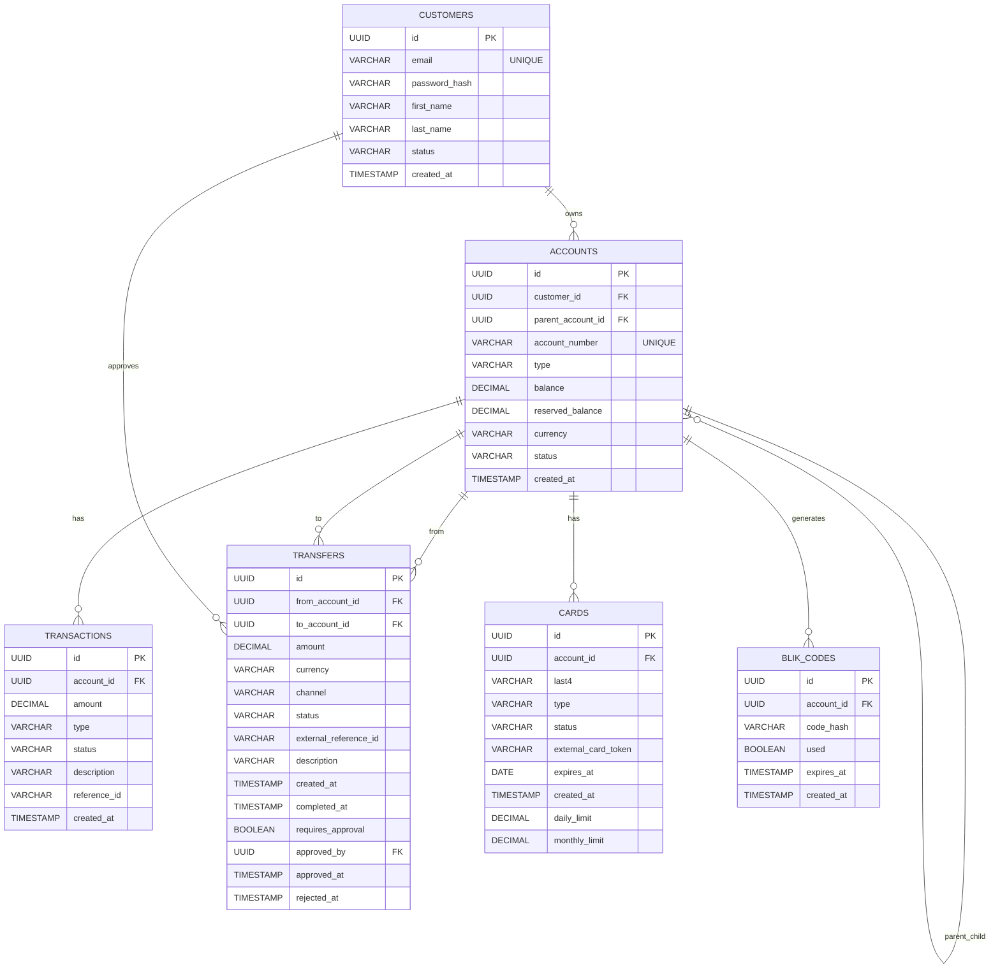

# EU Bank System

Celem projektu jest implementacja procesu biznesowego: systemu rozliczania przelewów i płatności pomiędzy bankami.

## Stack

| Warstwa         | Technologia                                                       |
|-----------------|-------------------------------------------------------------------|
| Backend         | Java 17 + Spring Boot + Spring Data JPA + Spring Security + Maven |
| Frontend        | React 19 + Vite + Tailwind                                        |
| Baza danych     | PostgreSQL 16 + system migracji: Flyway                           |
| Infrastruktura  | Docker + Docker Compose                                           |

## Zakres Funkcjonalności

### Integracja z modułem kart płatniczych

Backend banku integruje się z zewnętrznym modułem `FilipSl3/Karty-Platnicze-Aplikacje-Biznesowe` jako bank-wydawca kart. Moduł kart powinien działać z gatewayem REST pod adresem `http://localhost:8072`.

Konfiguracja po stronie banku:

```env
CARD_NETWORK_BASE_URL=http://host.docker.internal:8072
CARD_NETWORK_API_KEY=bank-key-eu-a
CARD_NETWORK_HMAC_SECRET=secret-eu-a-hmac
```

Endpointy banku:

| Metoda | Endpoint | Opis |
|---|---|---|
| `POST` | `/api/cards` | Zamawia kartę w zewnętrznej sieci kartowej i zapisuje token lokalnie |
| `GET` | `/api/cards` | Lista kart zalogowanego klienta |
| `GET` | `/api/cards/{cardId}` | Szczegóły karty |
| `POST` | `/api/cards/{cardId}/activate` | Aktywacja karty fizycznej/prepaid |
| `POST` | `/api/cards/{cardId}/block` | Blokada karty |
| `POST` | `/api/cards/{cardId}/unblock` | Odblokowanie karty |
| `PATCH` | `/api/cards/{cardId}/limits` | Lokalna aktualizacja limitów |
| `POST` | `/api/v1/authorize` | Callback dla sieci kartowej: rezerwacja środków |
| `POST` | `/api/v1/capture` | Callback dla sieci kartowej: finalne księgowanie płatności |
| `POST` | `/api/v1/refund` | Callback dla sieci kartowej: zwrot płatności |

Przykład wydania karty:

```json
{
  "accountId": "uuid-rachunku",
  "cardType": "VIRTUAL",
  "initialBalance": 0,
  "dailyLimit": 1000,
  "monthlyLimit": 5000
}
```

Pełny PAN i CVV są zwracane przez endpoint wydania karty tylko raz. Bank zapisuje lokalnie wyłącznie token, zamaskowany PAN, ostatnie 4 cyfry i status.

Przykład autoryzacji wywoływanej przez moduł kart:

```json
{
  "account_id": "uuid-rachunku",
  "amount": 150.00,
  "currency": "EUR",
  "transaction_id": "uuid-transakcji-z-sieci-kartowej",
  "merchant_name": "Sklep testowy"
}
```


## Struktura Bazy Danych 



## Uruchomienie aplikacji i ekosystemu płatności

Aby uruchomić aplikację w środowisku developerskim, upewnij się, że posiadasz zainstalowane narzędzia **Docker** oraz **Docker Compose**.

Do przetestowania przelewów zewnętrznych wymagane jest uruchomienie **Banku** oraz centralnego **Symulatora płatności (Payment Infra)**.

### Krok 1: Uruchomienie infrastruktury płatności (Symulatora)
Przelewy realizowane są za pośrednictwem symulatora TARGET/SEPA.
1. Wejdź do katalogu symulatora (np. `eu-payments-units`):
   ```bash
   cd ../eu-payments-units
   ```
2. Uruchom usługi symulatora:
   ```bash
   docker compose up -d --build
   ```
   *Salda banków i webhooki są rejestrowane w bazie symulatora automatycznie podczas startu backendu banku.*

### Krok 2: Uruchomienie banku
1. Wejdź do katalogu `eu-bank-system`:
   ```bash
   cd ../eu-bank-system
   ```
2. Skonfiguruj plik ze zmiennymi środowiskowymi (wersja domyślna):
   ```bash
   cp .env.example .env
   ```
3. Uruchom kontenery banku:
   ```bash
   docker compose up -d --build
   ```
4. Aplikacja będzie dostępna pod adresami:
   - **Frontend**: [http://localhost:3000](http://localhost:3000)
   - **Backend**: [http://localhost:8080](http://localhost:8080)
   - **Baza danych**: Port `5433` (zgodnie z `DB_HOST_PORT`)
